<picture>
<source media="(prefers-color-scheme: dark)" srcset="./profile-top.svg">

</picture>

# github-profile-dashboard 👋

Dashboard animado pro seu perfil do GitHub, estilo BoardUI dark/light: KPIs (contribuições, streak, melhor dia, mês, PRs, stars), gráfico mensal, linguagens mais usadas e calendário de contribuições — tudo com **dados reais e públicos, sem token, sem serviço de terceiros**. Um cron atualiza sozinho a cada 4 horas.

> 🇺🇸 English version: [README.en.md](./README.en.md)

## Comece em 3 passos

1. Clique em [**Use this template**](https://github.com/new?template_name=github-profile-dashboard&template_owner=lucasfdigital) e crie um repositório **com o seu username** (ex: `seu-user/seu-user`) — é esse README que aparece no seu perfil
2. Abra a aba **Actions** do repo criado e aguarde o primeiro run (~2 min) — ou dispare manualmente em *Update profile art → Run workflow*
3. Abra `github.com/seu-user` e pronto 🎉

Nada pra configurar: o workflow detecta o dono do repo sozinho (`github.repository_owner`).

## Configuração (`dashboard.json`)

| Chave | Default | O que faz |
|---|---|---|
| `github_username` | `null` (auto) | Override manual (útil pra rodar local). No CI sempre usa o dono do repo |
| `exclude_repos` | `[]` | `["dono/repo"]` que nunca entram nas linguagens (docs, playground...) |
| `sections.kpis` | `true` | Linha Contribuições · Este mês · Melhor dia · Streak |
| `sections.extras` | `true` | Linha PRs · Stars |
| `sections.chart` | `true` | Gráfico mensal do ano atual |
| `sections.languages` | `true` | Barras de linguagens (cores oficiais) |
| `sections.heatmap` | `true` | Calendário 53 semanas |

## Como funciona

- `scripts/fetch_contributions.py` — lê seu calendário público (`/users/<você>/contributions`, incluindo anos fechados) e salva `data/contributions.json`
- `scripts/fetch_github_stats.py` — soma linguagens dos seus repos (sem forks) + atividade recente + PRs + stars via REST pública
- `scripts/render_profile_top.py` — gera `profile-top.svg` (dark) e `profile-top-light.svg` (animações SMIL/CSS, que o GitHub toca)
- `.github/workflows/update-profile-art.yml` — cron a cada 4h + a cada push + manual; commita os SVGs e troca o `?v=` do README pra furar o cache de imagens do GitHub

## Limites honestos

- Sem token = API pública: repos privados e de organização **não** entram nas linguagens (as contribuições do gráfico, essas o GitHub conta)
- Forks são ignorados de propósito (se não, código alheio engole seu gráfico)
- Rate limit anônimo é 60 req/hora; cada execução usa ~40 — e se estourar, o script mantém os dados anteriores em vez de quebrar

## Licença

MIT — use, modifique e venda à vontade. Se curtir, deixa uma ⭐.
